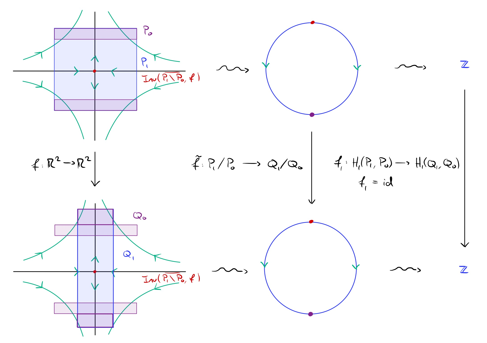

# Conley Index

### Mathematical Background

Continuing the discussion on Conley-Morse theory, the recurrent components of a dynamical system can be described by the Conley index. 

The first notion within the Conley index theory is that of an _isolating neighborhood_. A compact set ``N`` is called _isolating_ if 
```math
\text{Inv} (f, N) = \bigcup_{n \in \mathbb{Z}} f^n (N) \subset \text{int} (N) \, .
```
A set ``S`` is called an _isolated invariant set_ with _isolating neighborhood_ ``N`` if ``S = \text{Inv} (f, N)`` and ``N`` is isolating. 

An _index pair_ is a tuple of sets ``(P_1, P_0)`` such that where ``P_0 \subset P_1`` satisfying
1. _(isolation)_ ``\overline{P_1 \setminus P_0}`` is isolating,
2. _(forward invariance)_ ``f(P_0) \cap P_1 \subset P_0``,
3. _(exit set)_ \overline{f(P_1) \setminus P_1} \cap P_1 \subset P_0. 
This definition is quite abstract. One way to intuitively understand this definition is as follows: we find an invariant set and cover it with a set ``P_1``. Within the boundary of ``P_1``, we collect all points where the dynamical system points "outward", that is, points along ``P_0`` leave ``P_1`` immediately. 

Letting ``Q_1 = f(P_1)``, ``Q_0 = P_0 \cup ( Q_1 \setminus P_1 )``, we consider the relative homology groups ``H_\bullet (P_1, P_0)`` and ``H_\bullet (Q_1, Q_0)``. We further consider the map induced by ``f`` on homology
```math
f_\bullet :\, H_\bullet (P_1, P_0) \to H_\bullet (Q_1, Q_0) \, . 
```
Then the _Conley index_ is the topological shift equivalence class of ``\iota_\bullet^{-1} \circ f_\bullet``, where ``\iota :\, (P_1, P_0) \to (Q_1, Q_0)`` is the inclusion map. A full introduction of (relative) homology and induced maps is outside of the scope of this page, but is explained in [computationalhomology](@cite). Pictorally this can be thought of in the case of flows:



```@docs; canonical=false
index_pair
index_quad
@save
```

### Example

```@example 1
using GAIO
using StaticArrays

# hyperbolic saddle
const A = SA_F64[0.5 0;
                 0   2]

f(x) = A*x

c, r = (0,0), (4,4)
domain = Box(c, r)

P = BoxPartition(domain, (64,64))
S = cover(P, c)

F = BoxMap(:interval, f, domain)

```@example 1
N = isolating_neighborhood(F, S)
```

Compute pairs to construct the index map ``F:\ (P_1,\ P_0) \to (Q_1,\ Q_0)``

```@example 1
P1, P0, Q1, Q0 = index_quad(F, N)
```

```@example 1
transfers = TransferOperator(F, P1, Q1)
```

```@example 1
@save P1 
```

```@example 1
@save P0
@save Q1
@save Q0
@save transfers
```

Get `homcubes` at [Pawel Pilarczyk's website](http://www.pawelpilarczyk.com/chomp/software/)

```
$ homcubes -g P1_generators.dat -g Q1_generators.dat -g graph_generators.dat transfers.map P1.cub P0.cub Q1.cub Q0.cub

HOMCUBES, ver. 3.07, 09/25/15. Copyright (C) 1997-2020 by Pawel Pilarczyk.
This is free software. No warranty. Consult 'license.txt' for details.
Reading cubes to X from 'P1.cub'... 14 cubes read.
Reading cubes to A from 'P0.cub'... 10 cubes read.
Computing X\A... 10 cubes removed from X, 4 left.
Restricting A to the neighbors of X\A... 6 cubes removed, 4 left.
Reading cubes to Y from 'Q1.cub'... 28 cubes read.
Reading cubes to B from 'Q0.cub'... 24 cubes read.
Computing Y\B... 24 cubes removed from Y, 4 left.
300 bit fields allocated (0 MB) to speed up 2-dimensional reduction.
Reducing full-dim cubes from (X,A)... 4 removed, 4 left.
Reading the map on X\A from 'transfers.map' for extended reduction... Done.
Verifying if the image of X\A is contained in Y... Passed.
Expanding A in X... 1 moved to A, 1 left in X\A, 1 added to B.
Restricting A to the neighbors of X\A... 1 cubes removed, 2 left.
Reducing full-dim cubes from (X,A)... 0 removed, 3 left.
Note: The program assumes that the input map is acyclic.
Reading the map on X\A from 'transfers.map'... Done.
Reading the map on A from 'transfers.map'... Done.
Verifying if the image of A is contained in B... Passed.
Verifying if the image of A is disjoint from Y\B... Passed.
Computing the image of the map... 6 cubes.
Expanding B in Y... 1 cubes moved to B, 2 left in Y\B.
Restricting B to the neighbors of Y\B... 19 cubes removed, 7 left.
Reducing full-dim cubes from (Y,B)... 3 removed, 6 left.
Transforming X\A into cells... 1 cells added.
Transforming A into cells... 2 cells added.
Transforming Y\B into cells... 1 cells added.
Transforming B into cells... 5 cells added.
Collapsing faces in X and A... .. 4 removed, 4 left.
There are 10 faces of dimension up to 1 left in A.
Note: The dimension of X decreased from 2 to 1.
Creating the map F on cells in X... 14 cubes added.
Creating the map F on cells in A... 20 cubes added.
Creating a cell map for F... .. Done.
Note: It has been verified successfully that the map is acyclic.
Creating the graph of F... . 5 cells added.
Adding boundaries of cubical cells in Y and B... 4 cubical cells added.
Forgetting 14 cells from B.
Computing the image of F... 1 cells added.
Collapsing Y towards F(X)... .. 4 cells removed, 1 left.
Note: The dimension of Y decreased from 2 to 1.
Creating the chain complex of the graph of F... . Done.
Creating the chain complex of Y... . Done.
Creating the chain map of the projection... Done.
Time used so far: 0.00 sec (0.000 min).
Computing the homology of the graph of F over the ring of integers...
Reducing D_1: 0 + 2 reductions made. 
H_0 = 0
H_1 = Z
Saving generators of X to 'P1_generators.dat'... Done.
Saving generators of the graph of F to 'graph_generators.dat'... Done.
Computing the homology of Y over the ring of integers...
Reducing D_1: 
H_0 = 0
H_1 = Z
Saving generators of Y to 'Q1_generators.dat'... Done.
The map induced in homology is as follows:
Dim 0:  0
Dim 1:  f (x1) = y1
Total time used: 0.00 sec (0.000 min).
Thank you for using this software. We appreciate your business.
```
